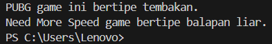

# Ujian Akhir Semester
<br>Mata Kuliah   : Praktikum Pemograman Berorientasi Objek
<br>Nama           : Yusuf Ginanjar
<br>NIM            : 1227050136
<br>Jurusan        : [Teknik Informatika](http://if.uinsgd.ac.id/) [UIN Sunan Gunung Djati Bandung](https://uinsgd.ac.id/)

## Deskripsi Umum
program yang didalamnya terdapat seluruh konsep PBO yang sudah dipelajari diantaranya terdapat :

<br> 1. Encapsulation
<br> 2. Inheritance
<br> 3. Polimorphism
<br> 4. Interface atau Abstract
Dibuat sesuai kriteria diatas dan minimal terdapat tiga class didalamnya, 
jika sudah selesai silahkan anda simpan dalam repository (dapat disimpan pada github masing-masing atau pada google drive) 
didalamnya terdapat kode program dan screenshot disertai penjelasan dari program sederhana yang telah dibuat.Z

## Source Code
```
    interface Tipe{
    void genre();
}
abstract class Game implements Tipe{
    private String nama;

    public game(String nama){
        this.nama = nama;
    }

    public String getNama(){
        return nama;
    }
}

class Tembakan extends Game {
    private String nama;
    public Tembakan(String nama){
        this.nama = nama;
    }
    @Override
    public void genre(){
        System.out.println(nama + " game ini bertipe tembakan.");
    }
    // @Override
    // public String getType(){
    //     return nama;
    // }
}

class Balapan extends Game {
    private String nama;
    public Balapan(String nama){
        this.nama = nama;
    }
    @Override
    public void genre(){
        System.out.println(nama + " game bertipe balapan liar.");
    }
    // @Override
    // public String getType(){
    //     return nama;
    // }
}

public class Main {
    public static void main(String[] args){
        Game tembakan = new Tembakan("PUBG");
        Game balapan =  new Balapan("Need More Speed");

        tembakan.genre();
        balapan.genre();
    }
} 
```
## Output 
  

## Deskripsi Penjelasan

1. Interface Tipe
    Ini adalah sebuah antarmuka dengan satu metode, yaitu `genre()`. Antarmuka ini menetapkan kontrak bahwa setiap kelas yang mengimplementasikan antarmuka `Tipe` harus menyediakan implementasi untuk metode `genre()`.

2. Abstract class Game
   kelas abstrak yang mengimplementasikan antarmuka `Tipe`. Ini memiliki satu variabel instance `nama` yang bersifat private dan sebuah konstruktor untuk menginisialisasi variabel tersebut. Ini juga memiliki metode `getNama()` yang mengembalikan nilai variabel `nama`.

3. Class Tembakan
    Ini adalah kelas yang mewarisi dari kelas `Game`. Ini memiliki variabel instance `nama` yang tersedia dari kelas induk dan mengimplementasikan metode `genre()` sesuai dengan kontrak antarmuka `Tipe`. Setiap kali objek `Tembakan` dibuat, ia akan mencetak pesan tentang jenis permainan tembakan yang diberikan.

4. Class Balapan
    Ini juga adalah kelas yang mewarisi dari kelas `Game`. Seperti `Tembakan`, ia memiliki variabel instance `nama` yang tersedia dari kelas induk dan mengimplementasikan metode `genre()` sesuai dengan kontrak antarmuka `Tipe`. Setiap kali objek `Balapan` dibuat, ia akan mencetak pesan tentang jenis permainan balapan yang diberikan.

5. Main Class
   Ini merupakan kelas utama yang memiliki metode `main()`. Di sini, objek `tembakan` dan `balapan` dibuat menggunakan kelas `Tembakan` dan `Balapan` secara berturut-turut. Kemudian, metode `genre()` dipanggil untuk masing-masing objek, yang akan mencetak pesan sesuai dengan jenis permainan yang sesuai.

Dengan demikian, kode ini mendemonstrasikan penggunaan interface (`Tipe`), inheritance (kelas `Tembakan` dan `Balapan` yang mewarisi dari kelas `Game`), encapsulation (variabel `nama` yang bersifat private), dan polimorfisme (pemanggilan metode `genre()` pada objek `tembakan` dan `balapan` yang sebenarnya memanggil implementasi yang berbeda dari metode tersebut).  
